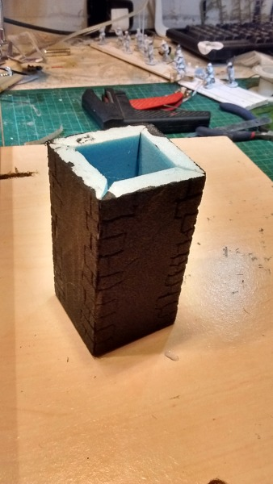
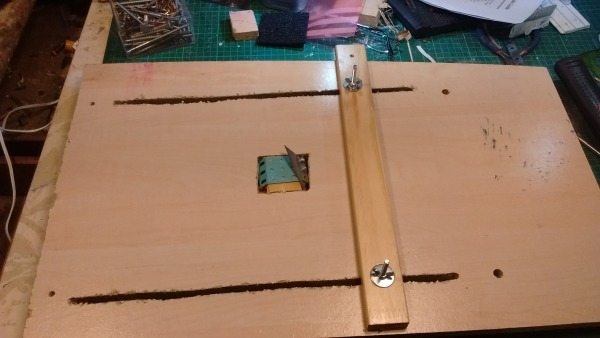
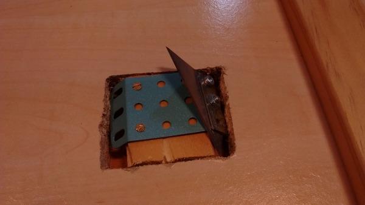
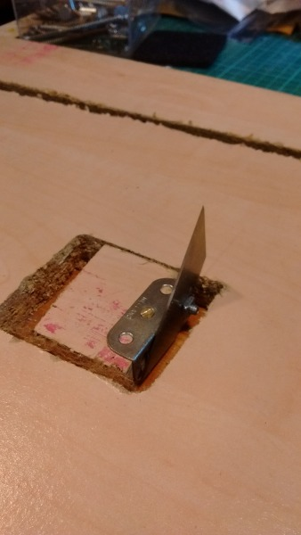

.. post:: 2016-02-14
   :tags: castles
   :category:
   :title: A 45 degree Styrofoam cutting jig

A 45 degree Styrofoam cutting jig
=================================

I was reading an old Warhammer book and saw a really good castle. It was pretty much [this](http://www.roundtable-bretonnia.org/index.php?option=com_fireboard&Itemid=1&func=view&catid=4&id=127253) one (he's read the same book, had the same idea and executed it pretty much flawlessly).

I thought I'd have a bit of a go making one out of 5mm Styrofoam. The results of my first practice tower were not great.

My biggest problem was that I found it very difficult cutting the edges square, as in - holding the knife exactly vertical as I made the cut. "I know", I thought, "I'll cut beveled edges, and hide away the lack of accuracy when I glue it". As the picture above demonstrates, that didn't work. I managed to cut the bevels so far away from 45 degrees (and with added waviness) that I had no chance of the edges even meeting in a straight line. Also, the poor cutting meant that getting it square was pretty much impossible. 

This produced a non-square tower with big wobbly gaps down the corners.

I researched 45 degree cutters. The best I could up with was [this](http://www.amazon.co.uk/WC6010-Foamwerks-Foamboard-Straight-Cutter/dp/B001JSQX3K) foam board cutter, which looks OK but is £8.57 (which is £7.57 more than I really wanted to pay) and would take nearly a month to arrive.

Instead I went to Tesco and bought two packs of Ralston Stanley knife blades for £1.45. Together with some Meccano I then tried to make something that looked like the foam board cutter.

Sadly, the small amount of Meccano I had, and the inability to mount the blade on a sliding mounting (like the foam board cutter has) meant that every design had to be quite tall (and hence difficult to keep straight) and had a big gap between the blade and the flat bit of the tool, meaning that cutting small bits would be difficult.

I then turned to my hot wire cutter and modified it to cut 45 degree cuts. This wasn't too hard, but meant that switching between 45 degrees and 90 degrees (i.e. straight up) would be a bit of an effort. Also, the reason that I didn't want to use the hot wire to cut these walls in the first place is that, however hard I try, I end up with slight striations on the cut surface, due to me not pushing the piece in totally straight.

My next idea was to put a guide on the hot wire cutter to try and prevent this.

It then occurred to me that I could make a similar arrangement, but with one of the blades rather than the wire. I could make the cutty bit static, while I moved the Styrofoam. In this configuration, it would be much easier to use the Meccano to mount the blade at the right angle, and because the blade didn't need to be connected at both ends (like a hot wire does), it would be much easier to make something that could easily switch between 45 and 90 degrees.

I took a bit of old chip board and cut a square hole in it. I mounted the blade on a bit wood the same size as the hole and glued a bit of thin MDF to the bottom. I then cut long guide holes and mounted a guide on them using bolts and wing nuts. Viola,

 
This close up shows how I used a bit of Meccano with 45 degree edges to mount the blade.

A similar method makes the 90 degree cutter,

    
Now to actually use it to make a castle.
 
